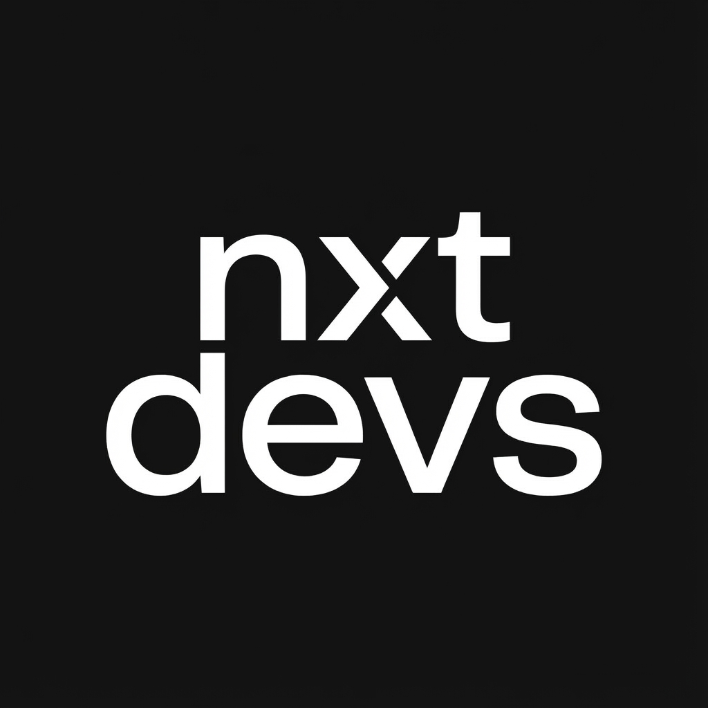
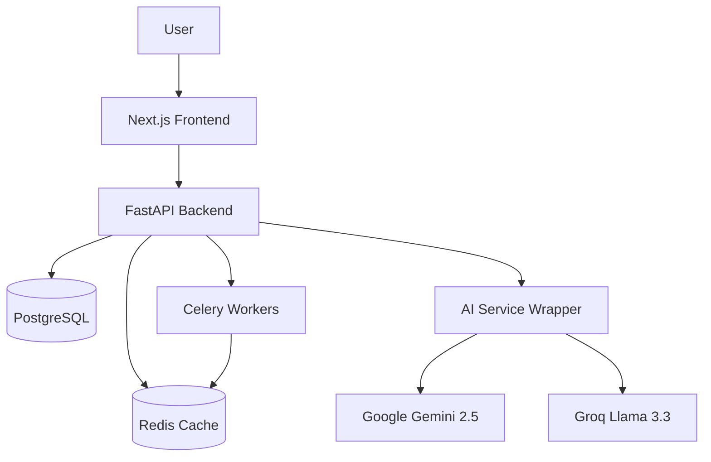
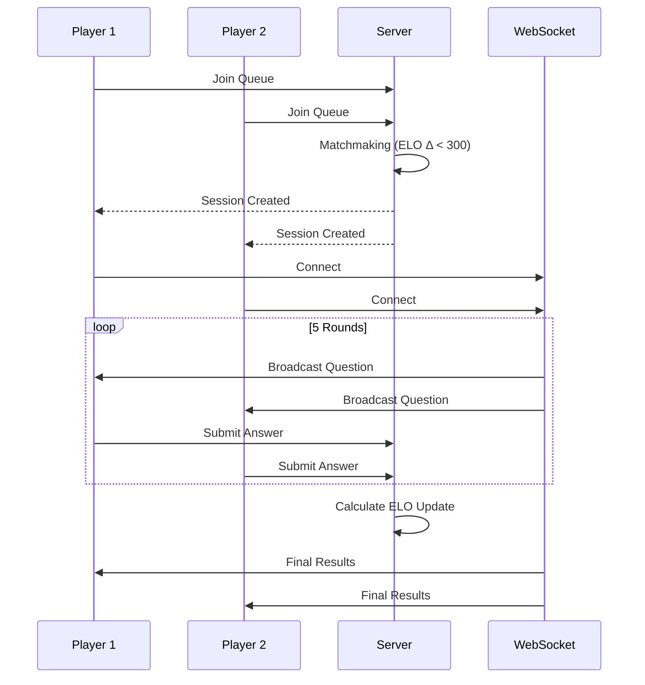

<div align="center">
  
  <h1>NxtDevs</h1>
  <p><strong>Algorithmic Thinking Trainer & Adaptive Learning Platform</strong></p>
  <p>
    A comprehensive system profiling cognitive patterns to identify biases and provide personalized coaching.
  </p>
  <p>
    
    
    
    
    
    
    
    
  </p>
</div>

---

## System Overview

Brainwave is an advanced algorithmic training platform designed to go beyond syntax verification. It utilizes a multi-dimensional profiling engine to track user cognition across 20+ "Thinking Axes," identifying specific cognitive pitfalls such as "Greedy Bias" or "Premature Optimization."

The platform integrates real-time competitive duels, generative AI coaching, and deep analytics to foster genuine problem-solving growth.

## Architecture & Workflows

### Core System Architecture



### 1v1 Duel Workflow



## Technology Stack

### Backend Infrastructure
| Component | Technology | Description |
|-----------|------------|-------------|
| **Core Framework** | Python 3.11 + FastAPI | High-performance async REST API |
| **Database** | PostgreSQL + SQLModel | Relational data persistence with ORM |
| **Asynchronous** | Celery + Redis | Distributed task queue for report generation |
| **Real-time** | WebSockets | Live bidirectional communication for duels |
| **AI LLMs** | Gemini 2.5 / Groq | Primary reasoning engine and fallback layer |

### Frontend Application
| Component | Technology | Description |
|-----------|------------|-------------|
| **Framework** | Next.js 16 | Server-side rendering and App Router |
| **Language** | TypeScript | Static typing and interface enforcement |
| **Styling** | Tailwind CSS | Utility-first design system |
| **Visualization** | Recharts | Data visualization for ELO and profiles |
| **State** | React Hooks | Local and global state management |

## Directory Structure

```text
Axiom/
├── backend/
│   ├── api/             # API Route configurations
│   ├── engine/          # Core scoring and orchestration logic
│   ├── models/          # Database schema definitions
│   ├── services/        # Business logic (AI, Matchmaking, Reports)
│   ├── celery_app.py    # Worker configuration
│   └── main.py          # Application entry point
├── frontend/
│   ├── app/             # Next.js App Router pages
│   ├── components/      # Reusable UI React components
│   └── lib/             # Utilities and helpers
```

## Installation & Deployment

### Prerequisites
*   Python 3.11+
*   Node.js 18+
*   Redis Server (running on default port 6379)
*   PostgreSQL Database

### Backend Setup

1.  **Environment Configuration**
    Create a `.env` file in the `backend` directory with valid credentials for Database, Redis, and AI Providers.

2.  **Dependency Installation**
    ```bash
    cd backend
    python -m venv venv
    source venv/bin/activate  # or .\venv\Scripts\activate on Windows
    pip install -r requirements.txt
    ```

3.  **Server Initialization** (Run from root)
    ```bash
    uvicorn backend.main:app --reload --port 8000
    ```

4.  **Worker Initialization** (Run from root)
    ```bash
    # Standard (Linux/Mac)
    celery -A backend.celery_app worker --loglevel=info
    
    # Windows (Required for local development)
    celery -A backend.celery_app worker --loglevel=info --pool=solo
    ```

### Frontend Setup

1.  **Dependency Installation**
    ```bash
    cd frontend
    npm install
    ```

2.  **Development Server**
    ```bash
    npm run dev
    ```

## License

Copyright © 2026 NxtDevs. All Rights Reserved.
Proprietary software.
